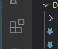
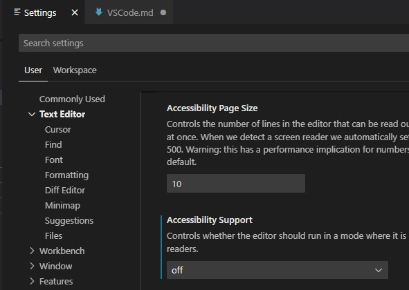
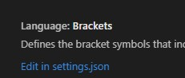
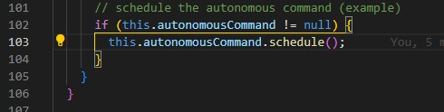

# Preparing your VSCode environment for use with the Robot Template

## Prepare Working Environment

### Install WPILib on your system

The WPILib installation images can be downloaded from [Github](https://github.com/wpilibsuite/allwpilib/releases). It is very important that everyone working on a particular robot is using the same version. Usually that will be the latest version, but it may not be. It possible to have more than one version of WPILib installed on the same system if they are from different years, but only one version can be installed for each year. Generally versions within a year a compatible, but be careful as this is not guaranteed. You can install a later version from the same year the same way as the original was installed. The installer will see the previous version and upgrade it.

After WPILib is installed you will need to install a version of GIT for your platform. The distribution for Windows is available at [Git for Windows](https://gitforwindows.org/). installing Git on MacOS is a little more involved. One way is to install [Xcode from the App Store](https://apps.apple.com/gb/app/xcode/id497799835?mt=12). Another option is to install the [Github for Desktop App](https://desktop.github.com/).

## Install extensions

### How to install extensions in VSCode

To install extensions in VSCode, you first click on the extensions sidebar (or type <Ctrl+Shift+X>).  It will show you a list of your installed extensions. Use this list to verify that you have the extensions in the following section installed. To search for an extension, simply type its name in the search field at the top of the extensions panel and it will display all the extensions in the extension marketplace that have those words. When you find the one you want, click on it to bring up an editor window with its description page. To install it, click on the "Install" button, either on the description page or the one next to its name in the extensions list. After the extension is installed, the install button on the list will change to the settings gear icon, and the button on the description will change to "Uninstall". You can use this "Uninstall" button to uninstall the extension if you no longer want it.

### Pre-Installed extensions

The following extensions come preinstalled in the WPILIB VSCode environment. If they are not installed, then you are not using the correct version of VSCode.

- C/C++
- Debugger for Java
- Language Support for Java
- Project Manager for Java
- WPILIB

As of 2024, WPILIB also installs extensions to support Python.

- Black Formatter
- Isort
- Pylance
- Python

### Install the Team Extension Pack

Our Team has an extension pack in the VSCode Marketplace that will automatically install all of the extensions needed to work with the Robot Template. Some of the included extensions are extension packs themselves, so they will cause other extensions to be installed as well. You can install the team extension pack by going to the extensions tab in VScode and searching for "Tough Techs". The topmost extension should be ours. You can verify it by looking at the icon, which is our team logo. To install it, just click the install button. The extension can also be found at the [Marketplace Page](https://marketplace.visualstudio.com/items?itemName=ToughTechs151.tt151extpack) or the [repository releases.](https://github.com/ToughTechs151/tt151extpack/releases)

The following extensions will be installed. Extension packs here will have an indented list of extensions that the pack will install. In a later section in this document, we will deal with how to set these extensions up.

- Checkstyle for Java
- Git Extension Pack (be sure to pick the one from Don Jayamanne, with over a million downloads.)
  - Git History
  - gitignore
  - GitLens
  - Open in Github, Bitbucket, Gitlab, Visualstudio.com
  - Project Manager
- Git Graph
- Github Actions
- Github Pull Requests and Issues
- Gradle for Java
- Intellicode
- Sonarlint
- Code Spell Checker
- Task Buttons
- Task Explorer

## Configure settings for VSCode with extensions

### How to set VSCode preferences

VSCode stores its settings in files called settings.json. There are two ways to change the settings.json file and the file itself can be in two locations. There is one file that sets the preferences for the user, no matter what project the user is working on, and another file for setting the preferences for the current workspace only.

The easiest way to change the preferences is by using the settings editor. You can bring up the settings editor either by using the "File" menu, selecting the "Preferences" side menu and choosing "Settings", or by typing <Ctrl+,> 

There are two tabs in the editor, one called "User" and one called "Workspace", corresponding to the two settings.json files. The settings editor is a user-friendly GUI for setting the most common preferences. To change the settings for extensions, scroll down the list to where it says "Extensions" and click on it to expand the list. You can also use the search bar at the top to search for specific settings.

Sometimes you need to edit the settings.json files directly. The easiest way to open the files in a VSCode editor window is to open the settings editor, then click the tab that corresponds to the file you want, either the user or workspace file, and then scroll down until you see a line that says "Edit in settings.json file".   Just click that line and an editor will appear with the correct file. The setting that was associated with the line will be inserted in the file, but you can just use the "Undo" command under the "Edit" menu (or <Ctrl+z>) to remove it again.

The syntax of JSON files is beyond the scope of this document, but if you are asked to modify one directly you will be shown exactly what to enter.

Once the file is changed how you want, remember to save it.

See [VSCode Getting Started documentation](https://code.visualstudio.com/docs/getstarted/settings) for more information on settings in VSCode.

### Specific Preference Settings

#### Recommended preferences

The following preferences are not required to use the Robot Template, but are just some changes that we recommend to make VSCode easier to work with.

- Bracket Pairs. By default VSCode colors matching bracket pairs with the same color. Further, if you click on one bracket in a pair, the other will also get a hollow cursor on it. However, it is easy to not notice a missing bracket or parenthesis if you are not looking for it. We recommend changing the user setting "Bracket Pairs" to "active". With both bracket pairs settings set to active VSCode will draw a colored line between the innermost enclosing brackets, based on where the cursor is. 

- Auto Save. Setting this to "afterDelay" causes VSCode to save the file you are editing when you change it, after a short delay. You can still use the undo command to undo changes in your session. And you can use the "Timeline" pane in the Explorer tab to go back to even older versions. Without the auto-save feature enabled, you have to remember to save your files before you build or commit or anything that accesses the file outside of the editor. You can also enable Auto Save temporarily from the "File" menu.

#### Extension-specific preferences

Many of the following settings are already set in the workspace settings file for the template, which is kept under source code management. If you make a copy of this template and are working with others, remember that any changes you make to this file will be used by everyone.

- Code Spell Checker. By default, this extension flags spelling errors as "problems" and when importing code from elsewhere, the number of such problems can obscure real problems that need to be fixed. This can be remedied by changing the reporting level from "information" to "Hint". The preferences for Code Spell Checker are already set in the workspace settings file, but it is a good idea to set them at the user level. 

  The default way hints show up in VSCode is very easy to miss, so next we change the color customization to make them stand out more, by putting two rows of red dots at the beginning of flagged words. Again, this setting is in the workspace, but you should add it at the user level. Simply open the Settings Editor, select the "User" tab, and in the search bar type "color workbench custom", then click on "Edit in settings.json" to open the User settings.json file in the editor. VSCode will have already inserted the headings for the setting for you. It will also suggest some choices with autocomplete. What you want to end up with looks like this:

  ```json
  "workbench.colorCustomizations": {
  "editorHint.border": "#ff0000",
  "editorHint.foreground": "#ff0000"
  }
  ```

  By default when you tell Code Spell Check to ignore a word, it adds it to a list of words maintained in the settings.json file. In the Robot Template we tell it to add the word to a custom dictionary in the workspace instead so the the dictionary can be updated a lot without risking changing the settings.json file in the workspace too much. You don't need to do this for your User preferences.

  Complete documentation for Code Spell Check can be found at [Code Spell Check Homepage.](https://streetsidesoftware.com/vscode-spell-checker/)

- Project Manager. The Project Manager panel allows you to organize your workspaces into an easily displayed list. You can save a workspace as a project, in which case it will appear in the "Favorites" list at the top of the panel, and the Project Manager can also detect workspaces or Git Repositories if you tell it where to look. You can use the Setting Editor, look under the "Project Manager" extension for the item "Project Manager > Git: Base Folders". Click the "Add Item" button, and enter the path to the base directory where your workspaces are saved. If you followed the team Java course, it will be "Documents\FRCProjects", under your home user folder. You can use the string "$home" to represent your home folder, so for this standard location you would enter "$home\Documents\FRCProjects" before you pressed enter. After that, the Project Manager will detect all Git repositories under that folder.

- Git. The Git extension might ask you if you want to auto-fetch from remote repositories. This means that updates made to the remote repository will be periodically downloaded to the local repository, without sending local changes up to the remote, as the "Sync" button or command does. When the fetch is done, it does not update the working files with the changes, but they are available locally if you want to update manually. In you probably want auto fetching to be on, unless your computer is primarily used as a Drive Station since a Drive Station spends a lot of time without the Internet being accessible. If you answered no to the prompt you can search for "Autofetch" under the Git extension in Settings Editor, and set it to "True".

  Another Git setting to change is "Git > Default Clone Directory". Open the Settings Editor, click on "User", search for "Default Clone Directory" and then click on "Edit in settings.json". In the editor window, enter your projects folder as you did for the Git project Base Folders between the quotes. Unfortunately, the Git Extension does not understand "$home" as the Project Manager did, so you will need to enter the entire path. Also, backslashes will need to be escaped with backslashes, so enter two backslashes for each one instead of one. So it will probably look something like "C:\\\\Users\\\\_myname_\\\\Documents\\\\FRCProjects". When cloning a Git repository VSCode will still open an explorer window for the folder, but it will already have the base folder selected.

  Finally, look for "Git > Merge Editor" and check the box so that the merge editor will automatically open when you have merge conflicts.

- Checkstyle for Java. The Checkstyle for Java extension needs to know what style rules it should enforce. The template workspace already has the standard Google style rules selected, but you may or may not want to enable them for all of your workspaces. There are two ways to set the rules to use. One is to search for "checkstyle configuration" in the Settings Editor, and then enter the path to a rules file in the "Java > Checkstyle: Configuration" field. However, the extension adds a command for setting the file, including the option of using one of the two built-in rules files. Simply open the command palette (\<Ctrl+Shift+p\>) and search for "checkstyle" and select "Set the Checkstyle Configuration File". You will be presented with a menu of options, one for the standard Google style, one for the standard Sun/Oracle style, one to enter the URL of a rules file, and one for selecting a local file. We are using the Google-style file.

More information on Checkstyle for Java can be found at the [Checkstyle for Java Homepage](https://marketplace.visualstudio.com/items?itemName%3Dshengchen.vscode-checkstyle). The style rules for Java can be found at [Google Java Style Guide](https://google.github.io/styleguide/javaguide.html).
